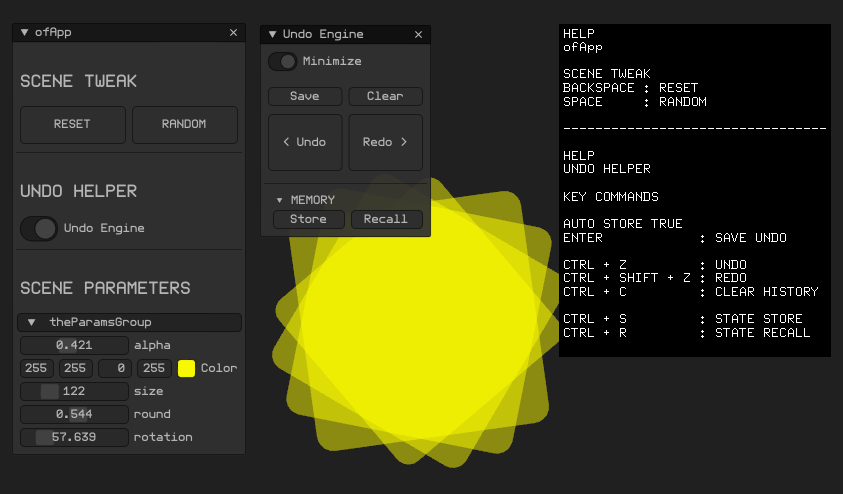

# ofxSurfingUndoHelper
[](https://opensource.org/licenses/MIT)

## Overview
An add-on helper to integrate an **Undo Engine** based on [ofxUndo](https://github.com/nariakiiwatani/ofxUndo) from [nariakiiwatani](https://github.com/nariakiiwatani), but simplified to easely use **ofParameters** and with an **ImGui** based **GUI**. 

## Screenshot


## Features
- Controls the **ofParameters** inside an **ofParameterGroup**.
- Adds **ImGui** controls to improve the workflow.
- **Files Mode** to allow **persistent Undo History** between App sessions.
- **Ram Mode** should be faster on big files / too many params scenarios.  

- Key Commands:  
ENTER            : SAVE UNDO  
CTRL + Z         : UNDO  
CTRL + SHIFT + Z : REDO  
CTRL + C         : CLEAR HISTORY  
CTRL + S         : STATE STORE  
CTRL + R         : STATE RECALL  

## Usage
- Check the example.
  
ofApp.h
```.cpp
#include "ofxSurfingUndoHelper.h"
#include "ofxSurfingImGui.h"

ofxSurfingUndoHelper undoManager;
ofxSurfing_ImGui_Manager guiManager;

ofParameterGroup params;

```

ofApp.cpp
```.cpp
void ofApp::setup()
{
    params.add(..) // -> add params

    undoManager.setup(params);

    guiManager.setup();
}

void ofApp::draw()
{
    guiManager.beginWindow();
    {
        undoManager.drawImGui();
    }
    guiManager.endWindow();
}

void ofApp::keyPressed(int key)
{
    if (key == 's') undoManager.doStoreUndo(); 
}
```

## Dependencies
* [ofxSurfingHelpers](https://github.com/moebiussurfing/ofxSurfingHelpers)  
* [ofxImGuiSurfing](https://github.com/moebiussurfing/ofxImGuiSurfing/) [WIP] 
* [ofxImGui](https://github.com/Daandelange/ofxImGui/). Fork from @**Daandelange**.  

* [ofxUndo](https://github.com/moebiussurfing/ofxUndo) Already added to `OFX_ADDON/libs/`. No need to add into **PROJECT GENERATOR**.    

## Tested Systems
* **Windows 10** / **VS 2017** / **OF ~0.11**
* **Windows 10** / **VS 2022** / **oF ~0.12**

## Author
An add-on by **@moebiusSurfing**  
*( ManuMolina ) 2021-2022*  

## License
[**MIT License**](https://github.com/LICENSE)

## TODO
+ Allow multiple independent groups.
+ Add Lite version without **ImGui** but **ofxGui** instead.